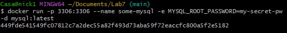
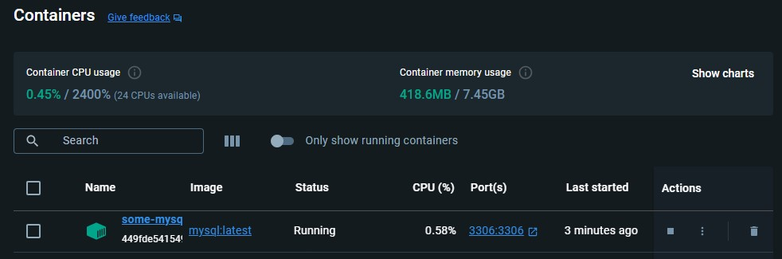
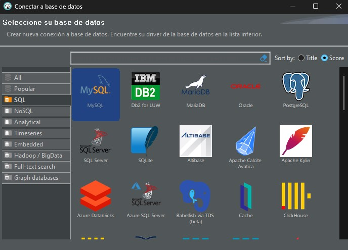
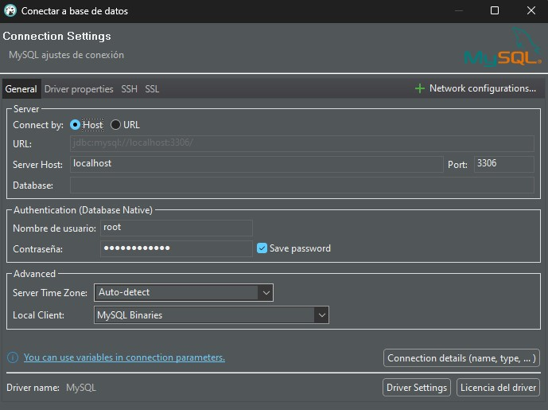
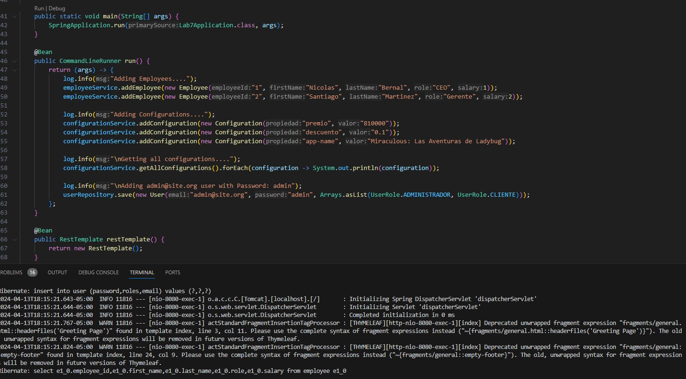
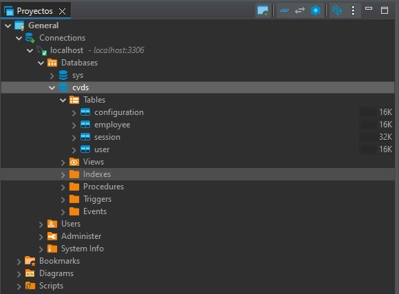
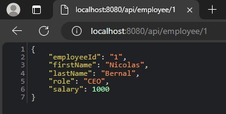
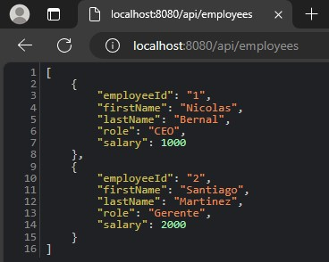

# MVC + Bootstrap CSS

## Structure Directory
https://studygyaan.com/spring-boot/spring-boot-project-folder-structure-and-best-practices

# Lab7
## Nicolas Bernal

Ejecutamos el comando y creamos el contenedor en Docker.

Creamos una nueva conexion, tipo MySql. La configuramos respectivamente, y vemos que se crea la conexion a localhost.

Luego de haber hecho el codigo (controller, repository, service. etc) para toda la clase Employee, ejecutamos la aplicacion, y vemos que corre bien.

Ahora en la base de cvds si recargamos deberian salir todas las tablas.

Finalmente, entramos a localhost8080, y realizamos las pruebas para ver que los metodos realizados esten funcionando, abajo encontramos imagenes para cuando queremos obtener todos los empleados y para cuando queremos buscar a uno en concreto con su id.

